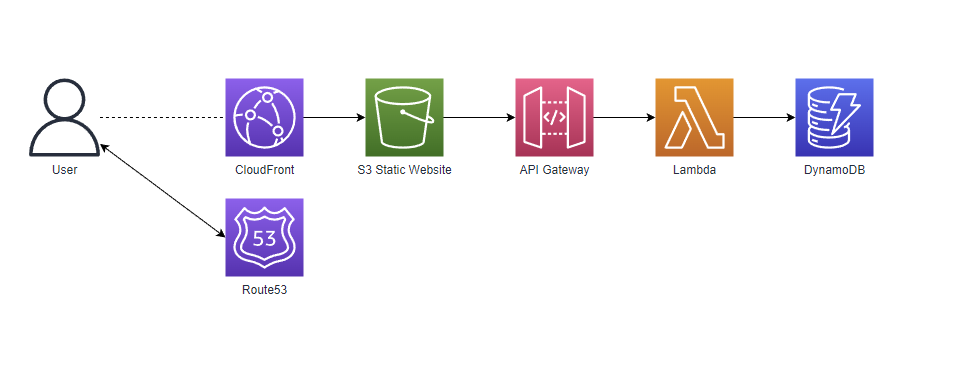

# Work In Progress!

# Challenge

The proposed challenge:
https://cloudresumechallenge.dev/docs/the-challenge/aws/

They have a guide specifically for [Terraform](https://cloudresumechallenge.dev/docs/extensions/terraform-getting-started/).

The end state should look similar to this.

Might not include Route53 as the domain is managed on cloudflare.

Tasks were split into separate modules by service... Some of these should have been consolidated. 

Opted to use OAC over OAI. 
https://aws.amazon.com/blogs/networking-and-content-delivery/amazon-cloudfront-introduces-origin-access-control-oac/

# Logical Map
