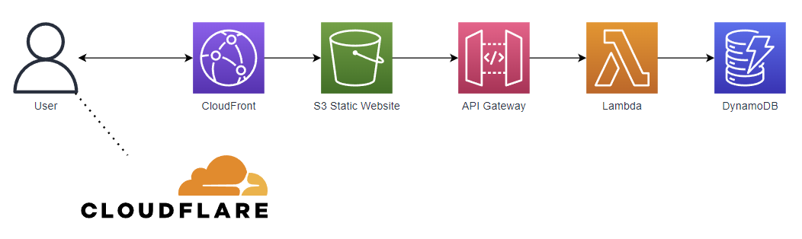

# Work In Progress!

# Challenge

The proposed challenge:
https://cloudresumechallenge.dev/docs/the-challenge/aws/

They have a guide specifically for [Terraform](https://cloudresumechallenge.dev/docs/extensions/terraform-getting-started/).

To do list
- [x] DNS w/ Cloudflare
- [x] ACM Certificates
- [x] CloudFront Distribution
- [ ] S3 Bucket Configurations
- [ ] API Gateway
- [ ] Lambda (Python)
- [ ] DynamoDB
- [ ] S3 Terraform State backend
- [ ] CI/CD (Github Actions)
- [ ] Blog post

Might not include Route53 as the domain is managed on cloudflare.

Tasks were split into separate modules by service... Some of these should have been consolidated. 

The end state should look similar to this.
# Logical Map
