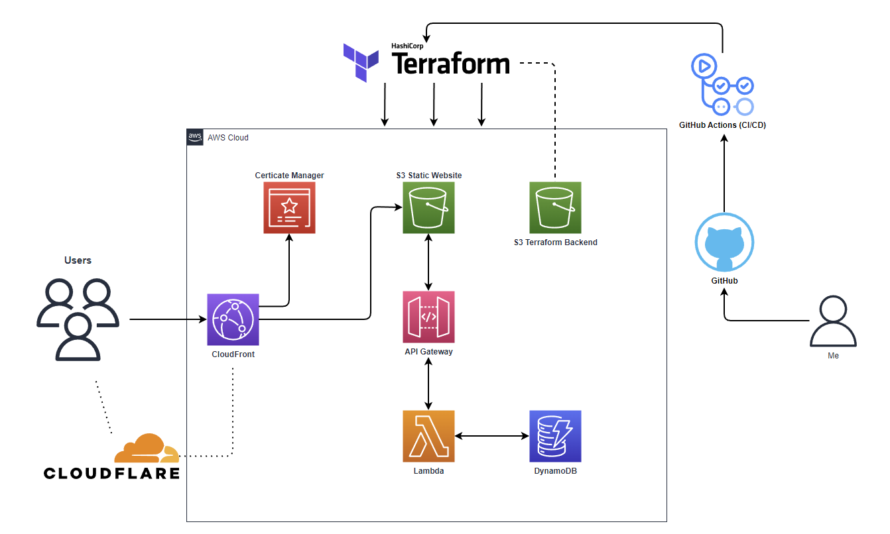

# Logical Map

# Challenge

The proposed challenge:
https://cloudresumechallenge.dev/docs/the-challenge/aws/

I've decided to use Hugo rather than write my whole website in html and css.\
Currently testing out [hugo-resume theme](https://themes.gohugo.io/themes/hugo-resume/), this still needs a few tweaks but it's good enough for now.

They have a guide specifically for [Terraform](https://cloudresumechallenge.dev/docs/extensions/terraform-getting-started/).

To do list
- [x] DNS w/ Cloudflare
- [x] ACM Certificates
- [x] CloudFront Distribution
- [x] S3 Bucket Configurations
- [x] API Gateway
- [x] Lambda (Python)
- [x] DynamoDB
- [x] Swap to static site generator
- [X] S3 Terraform State backend
- [ ] Separate frontend from backend repo
- [ ] CI/CD (Github Actions)
- [ ] Blog post

Optional Post objectives

- [ ] Find more reliable Hugo Theme

